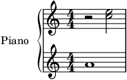
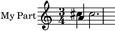
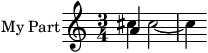

=====
Usage
=====

In this Section we demonstrate basic usage of the package.

Quick start: Reading note information from a MIDI file
======================================================

Before we present more in-depth usage of the package, we cover the common use case of reading note information from a MIDI file. The function :func:`~partitura.midi_to_notearray` does exactly that: It loads the note information from the MIDI file MIDI into a `structured numpy array <https://numpy.org/doc/stable/user/basics.rec.html>`_ with attributes onset (in seconds), duration (in seconds), pitch, velocity, and ID (automatically generated).
For the purpose of this example we use a small MIDI file that comes with the `partitura` package. The path to the example MIDI file is stored as :const:`partitura.EXAMPLE_MIDI`.

>>> import partitura
>>> path_to_midifile = partitura.EXAMPLE_MIDI
>>> note_array = partitura.midi_to_notearray(path_to_midifile)
>>> note_array # doctest: +NORMALIZE_WHITESPACE
array([(0., 2., 69, 64, 0, 1, 'n0'),
       (1., 1., 72, 64, 0, 2, 'n1'),
       (1., 1., 76, 64, 0, 2, 'n2')],
      dtype=[('onset_sec', '<f4'),
             ('duration_sec', '<f4'),
             ('pitch', '<i4'),
             ('velocity', '<i4'),
             ('track', '<i4'),
             ('channel', '<i4'),
             ('id', '<U256')])

The individual fields can be accessed using the field names as strings, e.g.:

>>> note_array["onset_sec"] # doctest: +NORMALIZE_WHITESPACE
array([0., 1., 1.], dtype=float32)

To access further information from MIDI files, such as time/key signatures, and control changes, see `Importing MIDI files`_.

Importing MusicXML
==================

As an example we take a MusicXML file with the following contents:

.. literalinclude:: ../partitura/assets/score_example.musicxml
   :language: xml

To load the score in python we first import the partitura package:

>>> import partitura

For convenience a MusicXML file with the above contents is included in the
package. The path to the file is stored as :const:`partitura.EXAMPLE_MUSICXML`, so
that we load the above score as follows:

>>> path_to_musicxml = partitura.EXAMPLE_MUSICXML
>>> part = partitura.load_musicxml(path_to_musicxml)

Displaying the typeset part
===========================

The :func:`partitura.render` function displays the part as a typeset score:

>>> partitura.render(part)

This should open an image of the score in the default image viewing
application of your desktop. The function requires that either `MuseScore
<https://musescore.org/>`_ or `lilypond <http://lilypond.org/>`_ is
installed on your computer.

Exporting a score to MusicXML
=============================

The :func:`partitura.save_musicxml` function exports score information to
MusicXML. The following line saves `part` to a file `mypart.musicxml`:

>>> partitura.save_musicxml(part, 'mypart.musicxml')

Viewing the contents of a score
===============================

The function :func:`~partitura.load_musicxml` returns the score as a
:class:`~partitura.score.Part` instance. When we print it, it displays its
id and part-name:

>>> print(part)
Part id="P1" name="Piano"

To see all of the elements in the part at once, we can call its
:meth:`~partitura.score.Part.pretty` method:

>>> print(part.pretty())
Part id="P1" name="Piano"
 │
 ├─ TimePoint t=0 quarter=12
 │   │
 │   └─ starting objects
 │       │
 │       ├─ 0--48 Measure number=1
 │       ├─ 0--48 Note id=n01 voice=1 staff=2 type=whole pitch=A4
 │       ├─ 0--48 Page number=1
 │       ├─ 0--24 Rest id=r01 voice=2 staff=1 type=half
 │       ├─ 0--48 System number=1
 │       └─ 0-- TimeSignature 4/4
 │
 ├─ TimePoint t=24 quarter=12
 │   │
 │   ├─ ending objects
 │   │   │
 │   │   └─ 0--24 Rest id=r01 voice=2 staff=1 type=half
 │   │
 │   └─ starting objects
 │       │
 │       ├─ 24--48 Note id=n02 voice=2 staff=1 type=half pitch=C5
 │       └─ 24--48 Note id=n03 voice=2 staff=1 type=half pitch=E5
 │
 └─ TimePoint t=48 quarter=12
     │
     └─ ending objects
         │
         ├─ 0--48 Measure number=1
         ├─ 0--48 Note id=n01 voice=1 staff=2 type=whole pitch=A4
         ├─ 24--48 Note id=n02 voice=2 staff=1 type=half pitch=C5
         ├─ 24--48 Note id=n03 voice=2 staff=1 type=half pitch=E5
         ├─ 0--48 Page number=1
         └─ 0--48 System number=1

This reveals that the part has three time points at which one or more musical
objects start or end. At `t=0` there are several starting objects, including a
:class:`~partitura.score.TimeSignature`, :class:`~partitura.score.Measure`,
:class:`~partitura.score.Page`, and :class:`~partitura.score.System`.

Extracting note information from a Part
=======================================

The notes in this part can be accessed through the :attr:`~partitura.score.Part.notes` property:

.. doctest::

  >>> part.notes  # doctest: +NORMALIZE_WHITESPACE
  [<partitura.score.Note object at 0x...>,
   <partitura.score.Note object at 0x...>,
   <partitura.score.Note object at 0x...>]
  >>> part.notes[0].duration  # duration in divs
  48

..
   Like note start and end times, durations are integer values that are  The unit of these values is specified in MusicXML files by the
   `divisions` element, and in MIDI files by the  . This element specifies the duration of
   a quarter note. The `divisions` value can vary within an MusicXML file, so it is
   generally better to work with musical time in beats.

Alternatively, basic note attributes can be accessed through the :attr:`~partitura.score.Part.note_array` property:

.. doctest::

  >>> arr = part.note_array
  >>> arr.dtype  # doctest: +NORMALIZE_WHITESPACE
  dtype([('onset_beat', '<f4'),
         ('duration_beat', '<f4'),
         ('onset_quarter', '<f4'),
		 ('duration_quarter', '<f4'),
         ('onset_div', '<i4'),
		 ('duration_div', '<i4'),
         ('pitch', '<i4'),
		 ('voice', '<i4'),
		 ('id', '<U256')])

The onsets and durations of the notes are specified in various units of time.

>>> for pitch, onset, duration in arr[["pitch", "onset_beat", "duration_beat"]]:
...     print(pitch, onset, duration)
69 0.0 4.0
72 2.0 2.0
76 2.0 2.0

..
   The part object has a property :attr:`part.beat_map
   <partitura.score.Part.beat_map>` that converts timeline times into beat
   times:

Iterating over arbitrary musical objects
========================================

In the previous Section we used :attr:`part.notes
<partitura.score.Part.notes>` to obtain the notes in the part as a list.
This property is a shortcut for the following statement:

.. doctest::

  >>> list(part.iter_all(partitura.score.Note))  # doctest: +NORMALIZE_WHITESPACE
  [<partitura.score.Note object at 0x...>,
   <partitura.score.Note object at 0x...>,
   <partitura.score.Note object at 0x...>]

That is, we iterate over all objects of class :class:`partitura.score.Note`, and
store them in a list.  The :meth:`~partitura.score.Part.iter_all` method can be
used to iterate over objects of arbitrary classes in the part:

>>> for m in part.iter_all(partitura.score.Measure):
...     print(m)
0--48 Measure number=1

The :meth:`~partitura.score.Part.iter_all` method has a keyword
`include_subclasses` that indicates that we are also interested in any
subclasses of the specified class. For example, the following statement
iterates over all objects in the part:

>>> for m in part.iter_all(object, include_subclasses=True):
...     print(m)
0--48 Note id=n01 voice=1 staff=2 type=whole pitch=A4
0--24 Rest id=r01 voice=2 staff=1 type=half
0--48 Page number=1
0--48 System number=1
0--48 Measure number=1
0-- TimeSignature 4/4
24--48 Note id=n02 voice=2 staff=1 type=half pitch=C5
24--48 Note id=n03 voice=2 staff=1 type=half pitch=E5

This approach is useful for example when we want to retrieve rests in
addition to notes. Since rests and notes are both subclassess of
:class:`GenericNote <partitura.score.GenericNote>`, the following works:

>>> for m in part.iter_all(partitura.score.GenericNote, include_subclasses=True):
...     print(m)
0--48 Note id=n01 voice=1 staff=2 type=whole pitch=A4
0--24 Rest id=r01 voice=2 staff=1 type=half
24--48 Note id=n02 voice=2 staff=1 type=half pitch=C5
24--48 Note id=n03 voice=2 staff=1 type=half pitch=E5

By default, `include_subclasses` is False.

..

Creating a musical score by hand
================================

You can build a musical score from scratch, by creating a :class:`partitura.score.Part` object. We
start by renaming the `partitura.score` module to `score`, for convenience:

>>> import partitura.score as score

Then we create an empty part with id 'P0' and name 'My Part' (the name is
optional, the id is mandatory), and a quarter note
duration of 10 units.

>>> part = score.Part('P0', 'My Part', quarter_duration=10)

Adding elements to the part is done by the
:meth:`~partitura.score.Part.add` method, which takes a musical element,
a start and an end time. Either of the `start` and `end` arguments can be
omitted, but if both are omitted the method will do nothing.

We now add a 3/4 time signature at t=0, and three notes. The notes are
instantiated by specifying an (optional) id, pitch information, and an
(optional) voice:

>>> part.add(score.TimeSignature(3, 4), start=0)
>>> part.add(score.Note(id='n0', step='A', octave=4, voice=1), start=0, end=10)
>>> part.add(score.Note(id='n1', step='C', octave=5, alter=1, voice=2), start=0, end=10)
>>> part.add(score.Note(id='n2', step='C', octave=5, alter=1, voice=2), start=10, end=40)

Note that the duration of notes is not hard-coded in the Note instances, but
defined implicitly by their start and end times in the part.

Here's what the part looks like:

>>> print(part.pretty())
Part id="P0" name="My Part"
 │
 ├─ TimePoint t=0 quarter=10
 │   │
 │   └─ starting objects
 │       │
 │       ├─ 0--10 Note id=n0 voice=1 staff=None type=quarter pitch=A4
 │       ├─ 0--10 Note id=n1 voice=2 staff=None type=quarter pitch=C#5
 │       └─ 0-- TimeSignature 3/4
 │
 ├─ TimePoint t=10 quarter=10
 │   │
 │   ├─ ending objects
 │   │   │
 │   │   ├─ 0--10 Note id=n0 voice=1 staff=None type=quarter pitch=A4
 │   │   └─ 0--10 Note id=n1 voice=2 staff=None type=quarter pitch=C#5
 │   │
 │   └─ starting objects
 │       │
 │       └─ 10--40 Note id=n2 voice=2 staff=None type=half. pitch=C#5
 │
 └─ TimePoint t=40 quarter=10
     │
     └─ ending objects
         │
         └─ 10--40 Note id=n2 voice=2 staff=None type=half. pitch=C#5

We see that the notes n0, n1, and n2 have been correctly recognized as
quarter, quarter, and dotted half, respectively.

Let's save the part to MusicXML:

>>> partitura.save_musicxml(part, 'mypart.musicxml')

When we look at the contents of `mypart.musicxml`, surprisingly, the `<part></part>` element is empty:

.. code-block:: xml

    <?xml version='1.0' encoding='UTF-8'?>
    <!DOCTYPE score-partwise PUBLIC
      "-//Recordare//DTD MusicXML 3.1 Partwise//EN"
      "http://www.musicxml.org/dtds/partwise.dtd">
    <score-partwise>
      <part-list>
        <score-part id="P0">
          <part-name>My Part</part-name>
        </score-part>
      </part-list>
      <part id="P0"/>
    </score-partwise>

The problem with our newly created part is that it contains no
measures. Since the MusicXML format requires musical elements to be
contained in measures, saving the part to MusicXML omits the objects we
added.

Adding measures
===============

One option to add measures is to add them by hand like we've added the
notes and time signature. A more convenient alternative is to use the
function :func:`~partitura.score.add_measures`:

>>> score.add_measures(part)

This function uses the time signature information in the part to add
measures accordingly:

>>> print(part.pretty())
Part id="P0" name="My Part"
 │
 ├─ TimePoint t=0 quarter=10
 │   │
 │   └─ starting objects
 │       │
 │       ├─ 0--30 Measure number=1
 │       ├─ 0--10 Note id=n0 voice=1 staff=None type=quarter pitch=A4
 │       ├─ 0--10 Note id=n1 voice=2 staff=None type=quarter pitch=C#5
 │       └─ 0-- TimeSignature 3/4
 │
 ├─ TimePoint t=10 quarter=10
 │   │
 │   ├─ ending objects
 │   │   │
 │   │   ├─ 0--10 Note id=n0 voice=1 staff=None type=quarter pitch=A4
 │   │   └─ 0--10 Note id=n1 voice=2 staff=None type=quarter pitch=C#5
 │   │
 │   └─ starting objects
 │       │
 │       └─ 10--40 Note id=n2 voice=2 staff=None type=half. pitch=C#5
 │
 ├─ TimePoint t=30 quarter=10
 │   │
 │   ├─ ending objects
 │   │   │
 │   │   └─ 0--30 Measure number=1
 │   │
 │   └─ starting objects
 │       │
 │       └─ 30--40 Measure number=2
 │
 └─ TimePoint t=40 quarter=10
     │
     └─ ending objects
         │
         ├─ 30--40 Measure number=2
         └─ 10--40 Note id=n2 voice=2 staff=None type=half. pitch=C#5

Let's see what our part with measures looks like in typeset form:

>>> partitura.render(part)

Although the notes are there, the music is not typeset correctly, since the
first measure should have a duration of three quarter notes, but instead is
has a duration of four quarter notes. The problem is that the note *n2*
crosses a measure boundary, and thus should be tied.

Splitting up notes using ties
=============================

In musical notation notes that span measure boundaries are split up, and then
tied together. This can be done automatically using the function
:func:`~partitura.score.tie_notes`:

>>> score.tie_notes(part)
>>> partitura.render(part)

Now the score looks correct. Displaying the contents reveals that the part
now has an extra quarter note *n2a* that starts at the measure boundary,
whereas the note *n2* is now a half note, ending at the measure boundary.

>>> print(part.pretty())
Part id="P0" name="My Part"
 │
 ├─ TimePoint t=0 quarter=10
 │   │
 │   └─ starting objects
 │       │
 │       ├─ 0--30 Measure number=1
 │       ├─ 0--10 Note id=n0 voice=1 staff=None type=quarter pitch=A4
 │       ├─ 0--10 Note id=n1 voice=2 staff=None type=quarter pitch=C#5
 │       └─ 0-- TimeSignature 3/4
 │
 ├─ TimePoint t=10 quarter=10
 │   │
 │   ├─ ending objects
 │   │   │
 │   │   ├─ 0--10 Note id=n0 voice=1 staff=None type=quarter pitch=A4
 │   │   └─ 0--10 Note id=n1 voice=2 staff=None type=quarter pitch=C#5
 │   │
 │   └─ starting objects
 │       │
 │       └─ 10--30 Note id=n2 voice=2 staff=None type=half tie_group=n2+n2a pitch=C#5
 │
 ├─ TimePoint t=30 quarter=10
 │   │
 │   ├─ ending objects
 │   │   │
 │   │   ├─ 0--30 Measure number=1
 │   │   └─ 10--30 Note id=n2 voice=2 staff=None type=half tie_group=n2+n2a pitch=C#5
 │   │
 │   └─ starting objects
 │       │
 │       ├─ 30--40 Measure number=2
 │       └─ 30--40 Note id=n2a voice=2 staff=None type=quarter tie_group=n2+n2a pitch=C#5
 │
 └─ TimePoint t=40 quarter=10
     │
     └─ ending objects
         │
         ├─ 30--40 Measure number=2
         └─ 30--40 Note id=n2a voice=2 staff=None type=quarter tie_group=n2+n2a pitch=C#5

Removing elements
=================

Just like we can add elements to a part, we can also remove them, using the
:meth:`~partitura.score.Part.remove` method. The following lines remove the
measure instances that were added using the
:func:`~partitura.score.add_measures` function:

>>> for measure in list(part.iter_all(score.Measure)):
...     part.remove(measure)

Note that we create a list of all measures in `part` before we remove them. This is necessary to avoid changing the contents of `part` while we iterate over it.

Importing MIDI files
====================

For quick access to note information from a MIDI file, use the function :func:`~partitura.midi_to_notearray`, as described in `Quick start: Reading note information from a MIDI file`_. In addition to this function, which returns a structured numpy array, partitura provides two further functions to load information from MIDI files, depending on whether the information should be treated as a performance or as a score (see `<introduction.html#score-vs-performance>`_):

* :func:`~partitura.load_performance_midi`
* :func:`~partitura.load_score_midi`

The :func:`~partitura.load_performance_midi` returns a :class:`~partitura.performance.PerformedPart` instance. 
The :class:`~partitura.performance.PerformedPart` instance stores notes, program change and control change messages.
The notes in :attr:`~partitura.performance.PerformedPart.notes` are dictionaries with the usual MIDI attributes "midi_pitch", "note_on", "note_off", etc. Additionally, there is a key called "sound_off" which returns note_off times adjusted by the sustain pedal. Set the on/off threshold value for the sustain_pedal MIDI cc message like so:

>>> path_to_midifile = partitura.EXAMPLE_MIDI
>>> performedpart = partitura.load_performance_midi(path_to_midifile)
>>> performedpart.sustain_pedal_threshold=64

Setting the sustain pedal threshold to 128 will prevent the change of "sound_off" values by sustain pedal.
When the MIDI file does not contain any pedal information, the "sound_off" is equal to "note_off", and setting :attr:`~partitura.performance.PerformedPart.sustain_pedal_threshold` has no effect.
Calling :attr:`~partitura.performance.PerformedPart.note_array` will return a structured array like :func:`~partitura.midi_to_notearray`.
The values in `note_array["duration_sec"]` are the actual duration of the note based on the `sound_off` time.

The function :func:`~partitura.load_score_midi` returns a :class:`~partitura.score.Part` instance.
The function estimates the score structure based on the "parts per quarter" value and the note_on/note_off times in a MIDI file.
This function *only* works with deadpan "score" MIDI files that can be generated by Digital Audio Workstations, Scorewriters, and other sequencers.
It is not suitable to estimate the score from a performed MIDI file, such as a recording of a pianist playing on a MIDI keyboard.

>>> midipart = partitura.load_score_midi(path_to_midifile)
>>> midipart.note_array  # doctest: +NORMALIZE_WHITESPACE
    array([(0., 4., 0., 4.,  0, 48, 69, 1, 'n0'),
           (2., 2., 2., 2., 24, 24, 72, 2, 'n1'),
           (2., 2., 2., 2., 24, 24, 76, 2, 'n2')],
          dtype=[('onset_beat', '<f4'),
                 ('duration_beat', '<f4'),
                 ('onset_quarter', '<f4'),
                 ('duration_quarter', '<f4'),
                 ('onset_div', '<i4'),
                 ('duration_div', '<i4'),
                 ('pitch', '<i4'),
                 ('voice', '<i4'),
                 ('id', '<U256')])

The note_array of a part is a structured array similar to the one of the
:class:`~partitura.performance.PerformedPart` instance, but the first 6 fields
refer to onset and duration in score time.  The score MIDI function correctly
identifies the note lengths of a whole note and two half notes.  However, the
position of the first measure bar (as well as other score properties) is only an
estimate as a "score" MIDI file of a score that begins with a tied quarter note
in an anacrusis measure would look exactly the same in the MIDI encoding.

Music Analysis
==============

The package offers tools for various types music analysis, including key estimation, tonal tension estimation, voice separation, and pitch spelling. The functions take the note information of in the form of an instance of 
:class:`~partitura.score.Part`,  :class:`~partitura.score.PartGroup`, or :class:`~partitura.performance.PerformedPart`, a list of :class:`~partitura.score.Part` objects or a `structured numpy array <https://numpy.org/doc/stable/user/basics.rec.html>`_, as returned by the :attr:`~partitura.score.Part.note_array` attribute.

Key Estimation
--------------

Key estimation is performed by the function
:func:`~partitura.musicanalysis.estimate_key`. The function returns a string representation of the root and mode of the key:

>>> key_name = partitura.musicanalysis.estimate_key(part.note_array)
>>> print(key_name)
C#m

The number of sharps/flats and the mode can be inferred from the key name using the convenience function :func:`~partitura.utils.key_name_to_fifths_mode`:

>>> partitura.utils.key_name_to_fifths_mode(key_name)
(4, 'minor')

Pitch Spelling
--------------

Pitch spelling estimation is performed by the function
:func:`~partitura.musicanalysis.estimate_spelling`. The function returns a structured array with pitch spelling information (i.e., with fields `step`, `alter` and `octave`) for each note in the input `note_array`. If the input to this method is an instance of :class:`~partitura.score.Part`,  :class:`~partitura.score.PartGroup`, or :class:`~partitura.performance.PerformedPart`, a list of :class:`~partitura.score.Part`, each row of the output corresponds to order of the notes in the `note_array` that would be generated by using the helper method :func:`~partitura.utils.ensure_notearray`.

>>> pitch_spelling = partitura.musicanalysis.estimate_spelling(part.note_array)
>>> print(pitch_spelling)
[('A', 0, 4) ('C', 1, 5) ('C', 1, 5)]

Voice Estimation
----------------

Voice estimation is performed by the function
:func:`~partitura.musicanalysis.estimate_voices`. The function returns a numpy array with voice information for each note in the input `note_array`. If the input to this method is an instance of :class:`~partitura.score.Part`,  :class:`~partitura.score.PartGroup`, or :class:`~partitura.performance.PerformedPart`, a list of :class:`~partitura.score.Part`, each row of the output corresponds to order of the notes in the `note_array` that would be generated by using the helper method :func:`~partitura.utils.ensure_notearray`.

>>> voices = partitura.musicanalysis.estimate_voices(part.note_array)
>>> print(voices)
[1 1 1]

Tonal Tension
-------------

Three tonal tension features proposed by Herremans and Chew (2016) are estimated by the function
:func:`~partitura.musicanalysis.estimate_tonaltension`. The function returns a strured array with fields `cloud_diameter`, `cloud_momentum`, `tensile_strain` and `onset`. In contrast to the other methods in `partitura.musicanalysis`, the tonal tension features are not computed for each note, but for specific time points, which are specified by argument `ss`, which can be a float specifying the step size, a 1D numpy array with time values, or `'onset`', which computes the tension features at each unique onset time.

>>> import numpy as np
>>> tonal_tension = partitura.musicanalysis.estimate_tonaltension(part, ss='onset')
>>> print(np.unique(part.note_array['onset_beat']))
[0. 1.]
>>> print(tonal_tension.dtype.names)
('onset_beat', 'cloud_diameter', 'cloud_momentum', 'tensile_strain')
>>> print(tonal_tension['cloud_momentum'])
[0.         0.16666667]

>>> partitura.musicanalysis.estimate_spelling(part.note_array)  # doctest: +NORMALIZE_WHITESPACE
array([('A', 0, 4), ('C', 1, 5), ('C', 1, 5)],
      dtype=[('step', '<U1'), ('alter', '<i8'), ('octave', '<i8')])
